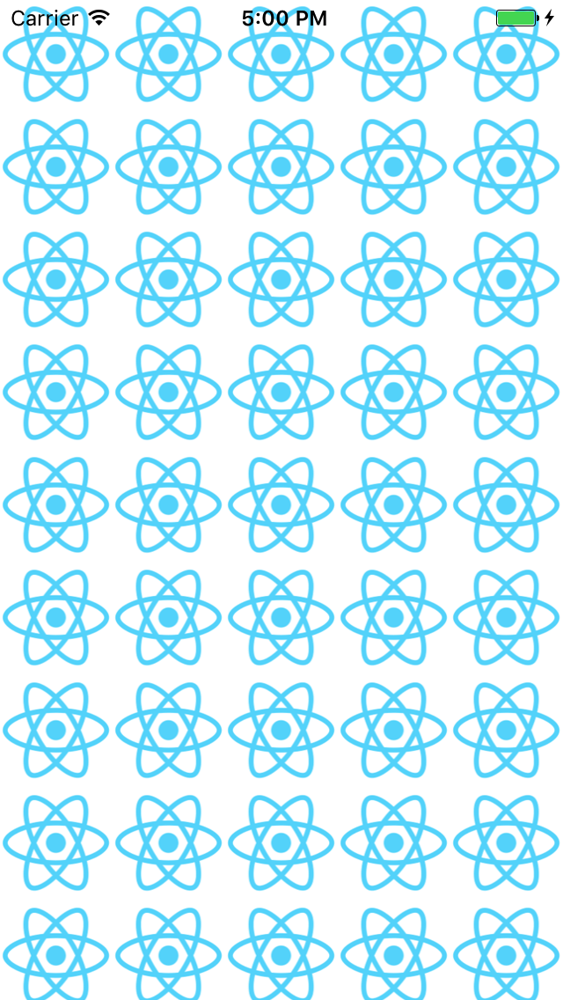
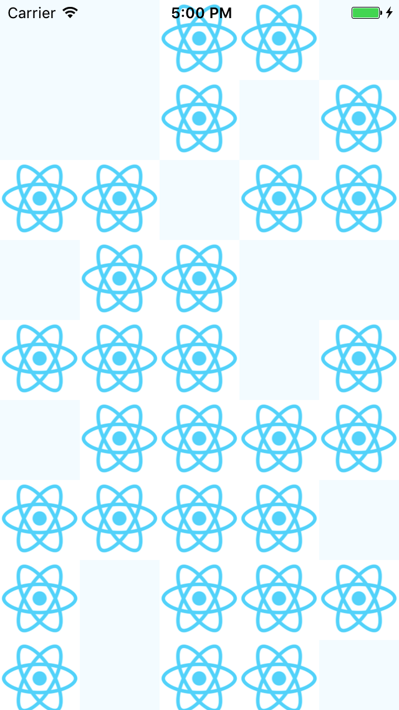

### Is this a bug report?

Yes.

### Have you read the [Contributing Guidelines](https://facebook.github.io/react-native/docs/contributing.html)?

YES

### Environment

1. `react-native -v`:0.47.1
2. `node -v`:v6.2.0
3. `npm -v`:3.9.0

Then, specify:

- Target Platform:
iOS

- Development Operating System:
macOS

- Build tools:
Xcode

### Steps to Reproduce

(Write your steps here:)

1. Download [the sample code](https://github.com/CodingForMoney/ReactNative-ImageLoadBugSample.git)
2. npm install,npm start , Run sample code
3. `cmd + R`, try reload the app for several times(Not Appearing-Certain).

### Expected Behavior

All images loaded successful.

### Actual Behavior

Some images failed to load.

### Reproducible Demo

https://github.com/CodingForMoney/ReactNative-ImageLoadBugSample.git

